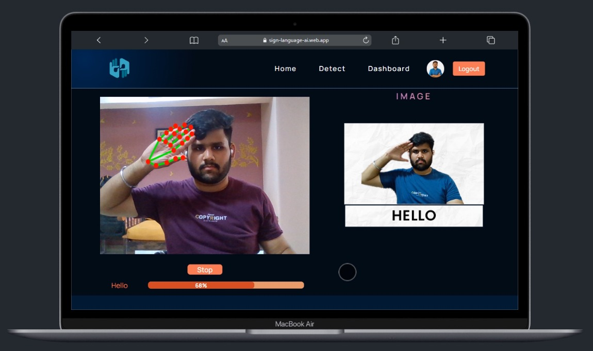
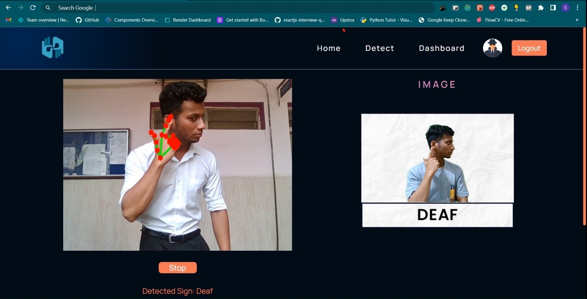
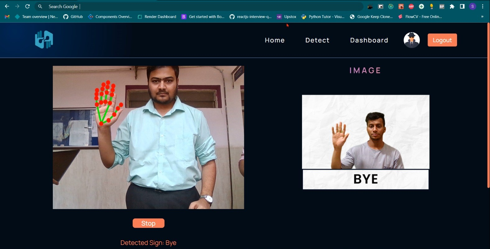
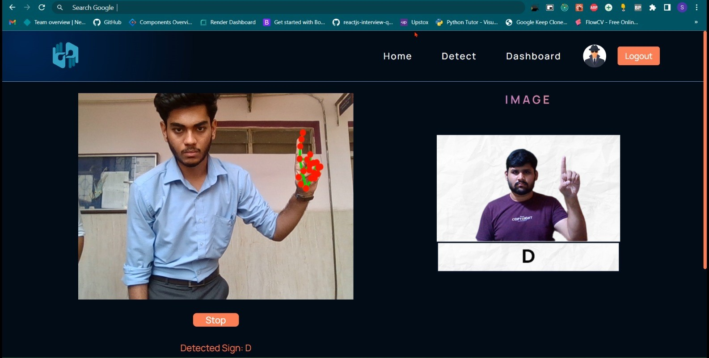
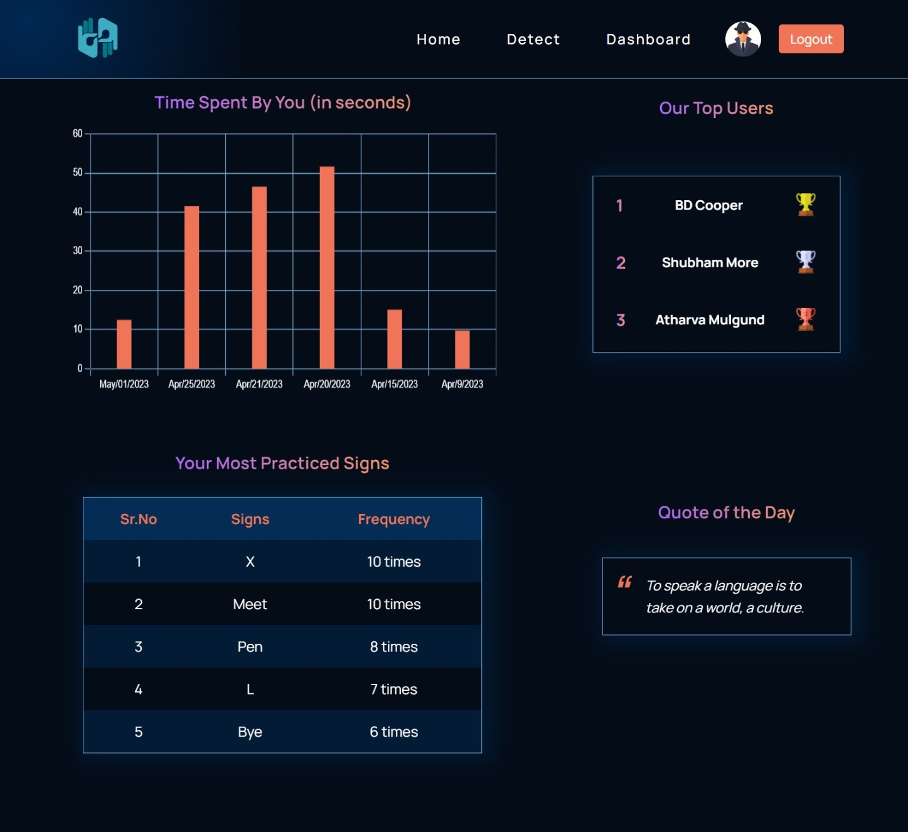

# **Sign Language Recognition for Deaf and Dumb**

Welcome to **Sign Language Recognition for Deaf and Dumb** — an innovative application designed to bridge communication gaps for the deaf and dumb community. This project leverages the power of machine learning and computer vision to recognize American Sign Language (ASL) gestures in real time, enabling seamless communication for everyone.

Our system is built to be easy to use, highly accurate, and capable of learning and adapting as more data is fed into it. Whether you are a beginner or a proficient signer, this app provides an engaging and adaptive learning experience.

## **Key Features**

- **Real-Time Recognition:** The app recognizes ASL gestures instantly, allowing users to communicate without any delays. No more need for complicated translations — just sign, and the app will understand!
  
- **Adaptive Learning:** The more you use the app, the better it gets. It learns from the gestures and user behavior, constantly improving the recognition process.
  
- **High Accuracy:** The system is trained on 26 alphabets and 16 commonly used words in ASL to ensure a broad range of gestures are recognized with high accuracy.
  
- **User Progress Tracking:** Stay on top of your learning journey with real-time updates and feedback. The app tracks your progress, showing you how many signs you've learned and how much time you've spent signing.
  
- **User Leaderboard:** Compete with others on the leaderboard! See how your progress compares to others who are using the app and engage in friendly competition.

## **How It Works**

The application uses the MediaPipe framework for gesture recognition, which processes webcam data in real time to detect hand movements and match them against trained models of ASL. It integrates seamlessly with a React frontend, Firebase for backend services, and Redux for state management.

### **Model Training**

We trained our machine learning model on a custom dataset of hand gestures representing both the 26 alphabets and 16 common ASL words. MediaPipe’s hand tracking API helps in processing and analyzing these gestures, ensuring a highly responsive system. The data is then used to train a model capable of understanding a wide range of signs, improving continuously as the system is exposed to more data.

## **Tech Stack**

### **Front-end:**
- **React** – A powerful JavaScript library for building interactive UIs that enables us to provide a seamless, dynamic user experience.
- **Redux** – Used for managing the state across the application, ensuring that user data and progress are stored and updated consistently.

### **Back-end:**
- **Firebase** – We use Firebase for various backend services including hosting, real-time database, and authentication. It provides a robust and scalable solution for handling user data and app functionality.

### **Machine Learning Framework:**
- **MediaPipe** – Google’s powerful cross-platform framework for building multimodal machine learning pipelines, especially useful for real-time hand gesture recognition.

### **NPM Packages:**
- **@mediapipe/drawing_utils** – Used for drawing the gesture recognition output on the screen.
- **@mediapipe/hands** – Handles the hand tracking needed to identify gestures.
- **@mediapipe/tasks-vision** – Used to apply machine learning models for vision tasks, such as recognizing gestures.
- **Chart.js** – Helps visualize user progress through charts, providing a visual representation of the learning journey.
- **Firebase** – Used for data storage and user authentication.
- **js-cookie** – A simple, lightweight JavaScript API for handling cookies, such as storing user session information.
- **React-Redux** – Ensures state management is consistent throughout the app.
- **React-Router-Dom** – Manages page navigation in the app.
- **React-Toastify** – Displays notifications to users, such as success or error messages.
- **React-Webcam** – Captures live video feed from the user’s webcam to track gestures in real-time.
- **Redux-Thunk** – Allows us to handle asynchronous actions with Redux.
- **UUID** – Generates unique identifiers for each session and user.

## **Steps to Set Up the Project**

To get started with the project, follow the steps in the setup documentation:

- [Project Setup Guide](https://docs.google.com/document/d/1siwZjc0LJQgKTn__vtzs8tMfr9OElrsThmqmRJc9dHE/edit?usp=sharing)

### **Quick Setup**
1. Clone the repository:  
   `git clone https://github.com/yourusername/sign-language-recognition.git`
   
2. Install dependencies:  
   `npm install`
   
3. Set up Firebase for authentication and data storage.  
   Create a `.env` file with your Firebase credentials.

4. Run the project:  
   `npm start`

5. Open your browser and navigate to `http://localhost:3000` to start using the app!

## **Screenshots**

Here are some of the screenshots showcasing the app’s functionality and user interface:

- **Sign for "Hello"**  
  

- **Sign for "Meet"**  
  

- **Sign for "Deaf"**  
  

- **Sign for "Bye"**  
  

- **Sign for "D"**  
  

- **Dashboard**  
  

## **Support**

For any questions, issues, or suggestions, feel free to reach out:

- **Email:** chauhantanishq1632@gmail.com  
- **LinkedIn:** [Tanishq Chauhan](https://www.linkedin.com/in/tanishq-chauhan-936b25258/)

## **Acknowledgements**

This project wouldn’t have been possible without the help of the following tools and frameworks:

- [React](https://react.dev/) – A JavaScript library for building user interfaces.
- [MediaPipe](https://developers.google.com/mediapipe) – Provides real-time hand gesture recognition.
- [Firebase](https://firebase.google.com/) – A platform for building web and mobile apps with real-time databases, authentication, and hosting.
- [NPM](https://www.npmjs.com/) – The package manager for JavaScript, providing a vast ecosystem of tools and libraries.
- [Chart.js](https://www.chartjs.org/) – A simple yet flexible JavaScript charting library.
